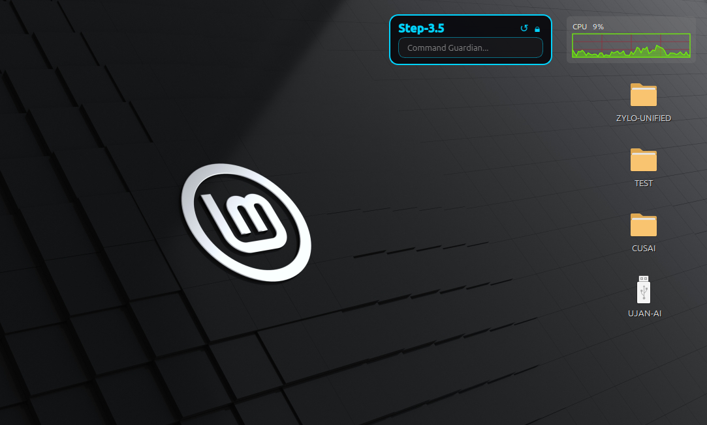
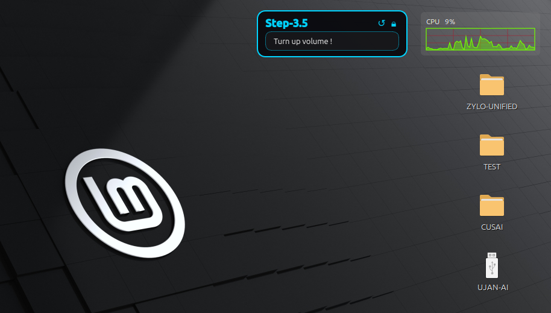
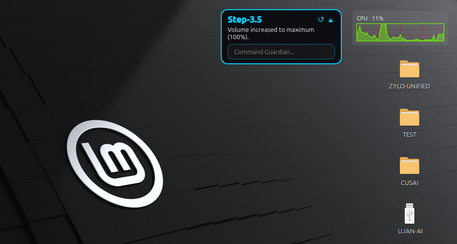
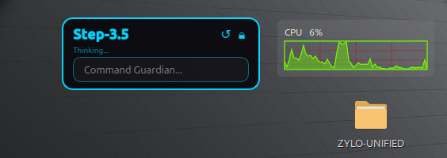

# ZYLO-SYSTEM-COMMAND-DESKLET


ZYLO-SYSTEM-COMMAND-DESKLET is a tightly focused Linux-only desktop assistant that blends a translucent PyQt6 widget with an OpenAI-compatible agent loop and a shell-execution feedback loop. The desklet sits below normal application windows, resists desktop-hide states, and keeps itself on the corner of your screen as a lightweight command intake surface. Users type natural-language requests directly into the widget, the embedded worker dispatches them to a configurable NVIDIA/Step-style chat endpoint, and the model can in turn either reply with a final answer or return structured JSON that tells the agent to execute commands on the host. Any output from the commands is echoed back to the model so it can complete multi-step workflows, and every desklet instance persists its position, size, lock state, and endpoint credentials for a seamless next launch. The combination of geometric persistence, context-aware status displays, and unstable desktop hints makes the desklet feel like a native assistant in any Linux session.


<p align="center">
  
</p>

<p align="center">
  
</p><p align="center">
  
  
</p><p align="center">
  
  
</p>

## Table of Contents
- [What This Project Does](#what-this-project-does)
- [Core Features](#core-features)
- [Architecture and Runtime Flow](#architecture-and-runtime-flow)
- [Complete Repository File Map](#complete-repository-file-map)
- [Requirements](#requirements)
- [Install](#install)
- [Run and CLI Options](#run-and-cli-options)
- [User Interaction Model](#user-interaction-model)
- [Configuration and Data Storage](#configuration-and-data-storage)
- [Autostart Integration](#autostart-integration)
- [Security and Safety Notes](#security-and-safety-notes)
- [Troubleshooting](#troubleshooting)
- [Uninstall](#uninstall)


## What This Project Does
ZYLO-SYSTEM-COMMAND-DESKLET assembles an autonomous Linux desktop companion with a deliberate separation between UI, orchestration, worker, configuration, and system helpers. It consistently keeps one or more translucent “desklet” windows alive, collects prompts from the user, feeds them into a constrained OpenAI-compatible assistant, and obeys the assistant when the model responds with the strictly defined JSON actions listed below.  
- Multi-instance desklets are orchestrated by `DeskletManager`, which ensures each persisted configuration spawns its own widget.  
- Geometry, lock states, user-specified dimensions, and endpoint metadata persist inside `~/.local/share/step_desklet/desklets.json`, so desklets resume layout on every launch.  
- Prompts are routed through the worker loop, which demands either `{"mode":"run","command":"…","reason":"…"}` to execute a shell command or `{"mode":"final","message":"…"}` to close the conversation.  
- Any command output (stdout/stderr/exit) becomes input for the next turn, allowing chained tasks without leaving the desklet.  
- Default startup installs an autostart `.desktop` entry under `~/.config/autostart/step-desklet.desktop`, but CLI flags allow opting out or resetting the config before even launching.

## Core Features
ZYLO-SYSTEM-COMMAND-DESKLET prioritizes lightweight persistence, transparency, and control over the desktop experience:
- **Multi-instance flow:** Each saved configuration spawns its own floating window, and the context menu lets you add/remove desklets without restarting the app.  
- **Geometry & lock persistence:** Instanced values for `x`, `y`, `w`, `h`, and `is_locked` live in the shared JSON so you can lock a desklet in place and have it stay there.  
- **Intentional UI layout:** A bold header, two icon buttons, and menu-less layout keep the footprint small, while a single-line input and multi-line response area serve both text queries and structured JSON feedback.  
- **Model endpoint controls:** Every instance can set `api_key`, `base_url`, and `model` values, letting you pair with different Step-style endpoints, official `"Step3-5"` flavors, or even a private proxy.  
- **Linux desktop friendliness:** The widget requests desktop-layer hints, reinvokes `apply_desklet_hints()` on show/resizing, and retries `xprop`/`wmctrl` commands so the desklet stays below active windows without vanishing when the desktop is revealed.

## Architecture and Runtime Flow
### 1) Entry Point (`main.py`)
- Parses CLI flags:
  - `--new` creates an additional desklet instance on startup.
  - `--reset` overwrites config file with default config.
  - `--no-autostart` skips writing autostart desktop entry.
- Ensures project root is in `sys.path`.
- Writes/refreshes autostart `.desktop` file by default.
- Starts `QApplication` in background mode (`setQuitOnLastWindowClosed(False)`).
- Starts `DeskletManager`, which loads and spawns all saved instances.

### 2) Manager Layer (`step_desklet/ui/manager.py`)
- Loads config instances via `load_configs()`.
- Spawns `StepDesklet` per instance.
- Handles add/remove lifecycle and corresponding config updates.

### 3) UI Layer (`step_desklet/ui/desklet.py`)
- Builds a frameless, translucent desklet window.
- Applies Linux/X11 window hints to stay desktop-layer-like.
- Supports:
  - Drag move (when unlocked).
  - Bottom-right resize handle zone.
  - Context menu actions: add new, lock/unlock, remove current, exit all.
- On Enter key in input:
  - Starts background thread.
  - Delegates to worker for model/command loop.
- Dynamically resizes response area and overall desklet height.
- Persists geometry with timer-based coalescing.

### 4) Worker Layer (`step_desklet/core/worker.py`)
- Creates `OpenAI` client with configured `api_key`, `base_url`, and `model`.
- Maintains conversation history with a fixed system prompt.
- For up to 100 iterations:
  - Calls chat completions.
  - Extracts first JSON object from model output.
  - If `mode=run`, executes shell command and sends stdout/stderr/exit code back as user feedback.
  - If `mode=final`, emits final response and returns.
- Uses `subprocess.run(..., shell=True, timeout=120)`.
- Contains basic `sudo` handling by transforming `sudo` to `sudo -S` and piping a placeholder password string.

### 5) Config Layer (`step_desklet/core/config.py`)
- Stores config at `~/.local/share/step_desklet/desklets.json`.
- Creates config directory if missing.
- Uses atomic-style save (`.tmp` + `fsync` + `os.replace`).
- Supports load, add instance, update instance, remove instance.

### 6) System Layer (`step_desklet/system/autostart.py`)
- Writes `~/.config/autostart/step-desklet.desktop`.
- Quotes executable path so paths with spaces remain valid.

## Complete Repository File Map
This section covers every file/folder currently present in the project root.

### Repository Layout
```
step_desklet_project/
├── install.sh
├── main.py
├── requirements.txt
├── step-desklet
├── uninstall.sh
└── step_desklet/
    ├── __init__.py
    ├── core/
    │   ├── __init__.py
    │   ├── config.py
    │   └── worker.py
    ├── system/
    │   ├── __init__.py
    │   └── autostart.py
    └── ui/
        ├── __init__.py
        ├── desklet.py
        └── manager.py
```


### Top-Level Files
- `main.py`
  - Application entry point and CLI.
- `install.sh`
  - Creates virtual environment, installs dependencies, creates launcher.
- `uninstall.sh`
  - Removes autostart file, config directory, local venv, and launcher.
- `requirements.txt`
  - Python dependency list: `PyQt6`, `openai`, `python-dotenv`, `requests`.
- `step-desklet`
  - Launcher script that activates local venv and runs `main.py`.
- `README.md`
  - This documentation.

### Python Package: `step_desklet/`
- `step_desklet/__init__.py`
  - Package marker (empty).
- `step_desklet/core/__init__.py`
  - Subpackage marker (empty).
- `step_desklet/core/config.py`
  - Config defaults, persistence, instance CRUD.
- `step_desklet/core/worker.py`
  - Model request loop and shell command execution.
- `step_desklet/system/__init__.py`
  - Subpackage marker (empty).
- `step_desklet/system/autostart.py`
  - Linux autostart file management.
- `step_desklet/ui/__init__.py`
  - Subpackage marker (empty).
- `step_desklet/ui/desklet.py`
  - Main desklet UI widget and interaction logic.
- `step_desklet/ui/manager.py`
  - Multi-desklet orchestration.

### Runtime/Generated Folder
- `venv/`
  - Local virtual environment with installed third-party packages and binaries.
  - Generated by `install.sh`.
  - Not source code; typically excluded from Git.

## Requirements
ZYLO-SYSTEM-COMMAND-DESKLET assumes a Linux desktop session (X11 currently gets the best results, Wayland support is limited to default Qt behavior).  
### Python
- Python 3.10+ is required for `PyQt6` and modern typing.  
- System `python3 -m venv` capability is necessary for the bundled `install.sh`.  
### Python Libraries (declared in `requirements.txt`)
- `PyQt6`
- `openai`
- `python-dotenv`
- `requests`
### Desktop Tooling
- `wmctrl` and `xprop` are optional but strongly recommended to keep the desklet visible when invoking “Show Desktop” or similar workspace toggles.  
- Without them, the widget still runs, but it might behave like a regular application window during workspace changes.  
### Debian/Ubuntu Example
```bash
sudo apt update
sudo apt install -y python3 python3-venv wmctrl x11-utils
```

## Install
Install is handled via the helper script, which bundles environment creation, dependency installation, and launcher setup.  
- Ensure the repo is executable: `chmod +x install.sh`
- Run `./install.sh` from the project root.
```bash
cd /home/ujan/Desktop/CUSAI/step_desklet_project
./install.sh
```
`install.sh` automates:
- `python3 -m venv venv` to isolate dependencies.  
- Activating the virtual environment and running `pip install -r requirements.txt`.  
- Marking `main.py` executable so the launcher works.  
- Writing the `step-desklet` helper that activates the venv and proxies to `main.py` from anywhere in the folder.  

Inspect the script before running it to confirm nothing unexpected happens.

### API KEY:
Replace `paste_your_api_key` of `step_desklet_project/step_desklet/ui/desklet.py` with your actual api key generated from [NVIDIA NIM website](https://build.nvidia.com/settings/api-keys) for **free**.

```python

        # Build Worker
        api_key = os.getenv("NVIDIA_API_KEY") or config.get("api_key") or "paste_your_api_key"
        self.worker = StepAIWorker(
            api_key=api_key,
            base_url=config.get("base_url", "https://integrate.api.nvidia.com/v1"),
            model=config.get("model", "stepfun-ai/step-3.5-flash")
        )

```

## Run and CLI Options
### Preferred Startup
The `step-desklet` launcher is the most convenient method because it activates `venv` for you.
```bash
./step-desklet
```
### Manual Run (for debugging or testing)
```bash
source venv/bin/activate
python3 main.py
```
### CLI Flags
- `--new`: create an additional desklet immediately after the manager starts.  
- `--reset`: wipe saved instances back to the built-in default config before anything else loads.  
- `--no-autostart`: skip rewriting the `~/.config/autostart/step-desklet.desktop` file on launch.  
### Example Scenarios
```bash
./step-desklet --new --no-autostart   # test multiple windows without changing autostart
./step-desklet --reset                # return to first-run layout
```

## User Interaction Model
The desklet keeps user interaction lightweight while still giving you full control over layout and lifecycle.  
### In-Widget Controls
- **Header:** bold “Step-3.5” label announces the active assistant.  
- **Reset button (↺):** clears the response/status text and brings focus back to the input.  
- **Lock button (🔒/🔓):** toggles `is_locked`, preventing move/resize actions when enabled.  
### Input Flow and Status
1. Type a request into the `Command Guardian...` field and press Enter.  
2. The widget disables the input and shows a status label (“Thinking…” or “Executing: …”) while the worker processes the call.  
3. If a response completes, it appears in the text area with auto-grow behavior; if an error occurs, the answer turns red.  
4. The input re-enables once the operation finishes, so you can continue conversing.  
### Context Menu
- `Add New Desklet` (spawns another instance).  
- `Lock/Unlock Position` (mirrors the header button).  
- `Remove This Desklet` (closes and deletes the selected instance from config).  
- `Exit All` (terminates every desklet and the underlying Qt application).

## Configuration and Data Storage
Every desklet instance pushes geometry, lock state, and endpoint data into a single JSON file so the entire fleet restores itself when `DeskletManager` reloads.
### Config Location
- Directory: `~/.local/share/step_desklet`
- File: `~/.local/share/step_desklet/desklets.json`
The loader rewrites the file whenever the shape is invalid, meaning a corrupted config cannot stop the app from launching—it just rebuilds from defaults.

### Default Config Shape
```json
{
  "instances": [
    {
      "id": "<uuid>",
      "x": 100,
      "y": 100,
      "w": 320,
      "h": 110,
      "is_locked": false,
      "user_sized": false,
      "api_key": "",
      "base_url": "https://integrate.api.nvidia.com/v1",
      "model": "stepfun-ai/step-3.5-flash"
    }
  ]
}
```
Each value can be modified manually if you prefer a different launch layout or model target; `add_instance()` clones this template when the UI spawns a new desklet.

### API Key Resolution Order
1. `NVIDIA_API_KEY` environment variable (highest priority).  
2. `api_key` field inside each instance configuration.  
3. Hardcoded fallback key inside `StepDesklet` (remove/replace for production).  
Set your preferred credential once, then commit the config or export the environment variable before launching.

### Backup Suggestions
- Copy `desklets.json` before experimentation to archive your layout.  
- Recreate preferred settings via a config snippet in dotfiles so you can propagate the same system to other machines.

## Autostart Integration
When `main.py` runs, it writes `~/.config/autostart/step-desklet.desktop` so the launcher starts automatically with your session. The helper quotes the executable path so renaming or moving the repo does not break the entry.

### `step-desklet.desktop` Contents
```
[Desktop Entry]
Type=Application
Exec="<absolute path to launcher or main.py>"
Hidden=false
NoDisplay=false
X-GNOME-Autostart-enabled=true
Name=ZYLO-SYSTEM-COMMAND-DESKLET
Comment=Autonomous AI Guardian Desklet
Terminal=false
StartupNotify=false
```
The `Exec` path points to `step-desklet` when it exists or falls back to `main.py` if run directly.

### Control
- Run `./step-desklet --no-autostart` to skip writing or updating the desktop entry.  
- Manually delete `~/.config/autostart/step-desklet.desktop` if you need to stop the-auto start without running the app.

## Security and Safety Notes
This project can execute arbitrary shell commands returned by the model. Read this carefully before production use or public release.

- `shell=True` is used for command execution, so the worker inherits the shell environment of the launcher.
- The model is explicitly instructed to run commands autonomously.
- Command output is reinjected into model context, enabling chained actions.
- A placeholder sudo password flow exists in worker logic (`sudo -S` transform).
- The worker loops up to 100 times per request, so a single prompt can run many commands without additional prompts.
- A hardcoded fallback API key is currently in source.

Minimum hardening before serious use:
- Replace the placeholder sudo password and limit sudo calls to clearly defined tasks.
- Cache command history/outputs in logs before sending them to the model for accountability.
- Consider sandboxing the worker (e.g., `bubblewrap`, Docker) when commands interact with sensitive files.

## Troubleshooting
### Desklet does not stay on desktop correctly
- Install `wmctrl` and `xprop` (packaged inside `x11-utils` on Debian/Ubuntu).  
- Some window managers or Wayland sessions ignore `_NET_WM_WINDOW_TYPE`, so the widget may behave like a regular window when show-desktop is triggered.
- If the desklet disappears, run `wmctrl -l` to confirm its window ID is still registered.

### No model response or repeated errors
- Check connectivity and API rate limits.
- Confirm `NVIDIA_API_KEY` is set (`echo $NVIDIA_API_KEY`) or stored per-instance in `desklets.json`.  
- Validate `base_url` and `model` entries inside configs; a typo prevents successful HTTP calls.
- Monitor the terminal where `step-desklet` runs for exception tracebacks from `openai.OpenAI`.

### UI appears but actions silently fail
- Launch via terminal to catch PyQt6 warnings/exceptions:
```bash
./step-desklet
```
- If the worker thread throws, look for red “Error:” text in the response area (Qt only allows updating UI from the main thread, so errors show via the signal to `update_error`).

### Reset geometry or configuration
- Use `./step-desklet --reset` to write `DEFAULT_CONFIG` and close all existing desklets.
- Delete `~/.local/share/step_desklet/desklets.json` manually if the file becomes stale.

## Uninstall
From project root:
```bash
chmod +x uninstall.sh
./uninstall.sh
```

`uninstall.sh` removes:
- `~/.config/autostart/step-desklet.desktop`
- `~/.local/share/step_desklet`
- Local `venv/`
- Launcher `step-desklet`


