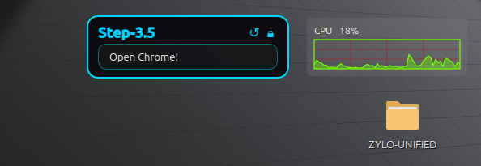
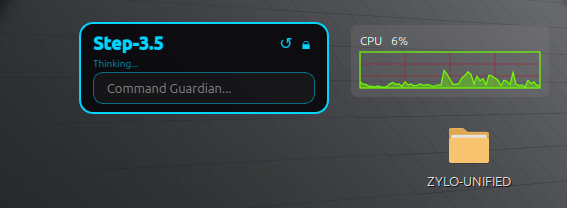
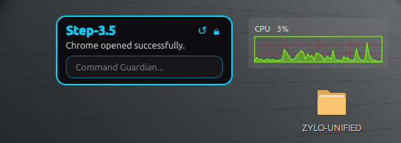

# ZYLO-SYSTEM-COMMAND-DESKLET


ZYLO-SYSTEM-COMMAND-DESKLET is a Linux-only desktop assistant that combines a translucent PyQt6 desklet, an OpenAI-compatible command engine, and a hold-to-talk voice pipeline. The desklet sits below normal app windows, supports typed commands and global `Ctrl+M` push-to-talk voice commands, executes model-returned shell actions, and persists instance geometry/config across launches. Voice mode records while the hotkey is held, transcribes with `stt.py`, runs the same `step-3.5-flash` command engine used by typed mode, then speaks the final result using NVIDIA TTS (energetic Magpie voice).


<p align="center">
  
</p>

<div align="center">
  
  
  
</div>

<div align="center">
  
  
  
</div>

## Table of Contents
- [What This Project Does](#what-this-project-does)
- [Core Features](#core-features)
- [Architecture and Runtime Flow](#architecture-and-runtime-flow)
- [Complete Repository File Map](#complete-repository-file-map)
- [Requirements](#requirements)
- [Install](#install)
- [Run and CLI Options](#run-and-cli-options)
- [User Interaction Model](#user-interaction-model)
- [Configuration and Data Storage](#configuration-and-data-storage)
- [Autostart Integration](#autostart-integration)
- [Security and Safety Notes](#security-and-safety-notes)
- [Troubleshooting](#troubleshooting)
- [Uninstall](#uninstall)
- [Contributing](#contributing)
- [Design Philosophy](#design-philosophy)
- [Disclaimer](#disclaimer)
- [License](#license)
- [Acknowledgements](#acknowledgements)
- [Project Status](#project-status)
- [Author](#author)
- [Final Note](#final-note)


## What This Project Does
ZYLO-SYSTEM-COMMAND-DESKLET assembles an autonomous Linux desktop companion with a deliberate separation between UI, orchestration, worker, configuration, and system helpers. It consistently keeps one or more translucent “desklet” windows alive, collects prompts from the user, feeds them into a constrained OpenAI-compatible assistant, and obeys the assistant when the model responds with the strictly defined JSON actions listed below.  
- Multi-instance desklets are orchestrated by `DeskletManager`, which ensures each persisted configuration spawns its own widget.  
- Geometry, lock states, user-specified dimensions, and endpoint metadata persist inside `~/.local/share/step_desklet/desklets.json`, so desklets resume layout on every launch.  
- Prompts are routed through the worker loop, which demands either `{"mode":"run","command":"…","reason":"…"}` to execute a shell command or `{"mode":"final","message":"…"}` to close the conversation.  
- Any command output (stdout/stderr/exit) becomes input for the next turn, allowing chained tasks without leaving the desklet.  
- Voice mode uses global hold-to-talk (`Ctrl+M`), routes transcripts through the same worker engine, and plays spoken output via NVIDIA TTS.
- Default startup installs an autostart `.desktop` entry under `~/.config/autostart/step-desklet.desktop`, but CLI flags allow opting out or resetting the config before even launching.

## Core Features
ZYLO-SYSTEM-COMMAND-DESKLET prioritizes lightweight persistence, transparency, and control over the desktop experience:
- **Multi-instance flow:** Each saved configuration spawns its own floating window, and the context menu lets you add/remove desklets without restarting the app.  
- **Geometry & lock persistence:** Instanced values for `x`, `y`, `w`, `h`, and `is_locked` live in the shared JSON so you can lock a desklet in place and have it stay there.  
- **Dual interaction modes:** Typed mode shows full model replies in the desklet; voice mode hides the chat box and uses global `Ctrl+M` hold-to-talk from anywhere on the desktop.  
- **Voice pipeline:** Hold `Ctrl+M` to record, release to stop, transcribe with `stt.py`, execute via `step-3.5-flash`, and speak output with NVIDIA TTS (`Magpie-Multilingual.EN-US.Aria.Happy`).  
- **Intentional UI layout:** Header controls include a voice button (left of reset), reset button, and lock button; listening/speaking state drives border glow animations and mic/speaker icon state.  
- **Model endpoint controls:** Every instance can set `api_key`, `base_url`, and `model` values, letting you pair with different Step-style endpoints, official `"Step3-5"` flavors, or even a private proxy.  
- **Open-command reliability:** File/app open intents use fast-path handling, detached GUI launch commands, and fallback resolution for recent-file and missing-path requests.  
- **Linux desktop friendliness:** The widget requests desktop-layer hints, reinvokes `apply_desklet_hints()` on show/resizing, and retries `xprop`/`wmctrl` commands so the desklet stays below active windows without vanishing when the desktop is revealed.

## Architecture and Runtime Flow
### 1) Entry Point (`main.py`)
- Parses CLI flags:
  - `--new` creates an additional desklet instance on startup.
  - `--reset` overwrites config file with default config.
  - `--no-autostart` skips writing autostart desktop entry.
- Ensures project root is in `sys.path`.
- Writes/refreshes autostart `.desktop` file by default.
- Starts `QApplication` in background mode (`setQuitOnLastWindowClosed(False)`).
- Starts `DeskletManager`, which loads and spawns all saved instances.

### 2) Manager Layer (`step_desklet/ui/manager.py`)
- Loads config instances via `load_configs()`.
- Spawns `StepDesklet` per instance.
- Handles add/remove lifecycle and corresponding config updates.

### 3) UI Layer (`step_desklet/ui/desklet.py`)
- Builds a frameless, translucent desklet window.
- Applies Linux/X11 window hints to stay desktop-layer-like.
- Supports typed mode and voice mode:
  - **Typed mode:** input box + rendered response area.
  - **Voice mode:** hides input/response surface and shows status-only flow.
- Header controls:
  - Voice toggle button (`🔈`/`🔊`) to enable/disable voice mode.
  - Reset button (`↺`) and lock button (`🔒`/`🔓`).
- UI interactions:
  - Drag move (when unlocked).
  - Bottom-right resize handle zone.
  - Context menu actions: add new, lock/unlock, remove current, exit all.
- On Enter key in input:
  - Starts background thread.
  - Delegates to worker for model/command loop.
- Dynamically resizes response area and overall desklet height.
- Persists geometry with timer-based coalescing.
- Triggers listening/speaking border glow animations during voice flow.

### 4) Worker Layer (`step_desklet/core/worker.py`)
- Creates `OpenAI` client with configured `api_key`, `base_url`, and `model`.
- Maintains conversation history with a fixed system prompt.
- For each request (up to 100 iterations in normal mode):
  - Calls chat completions.
  - Extracts first JSON object from model output.
  - If `mode=run`, executes shell command and sends stdout/stderr/exit code back as user feedback.
  - If `mode=final`, emits final response and returns.
- Includes open-intent optimizations:
  - Fast short-context path for direct `open ...` requests.
  - Recent-file intent (`open last N modified files ...`) support.
  - Open-command normalization (`open` -> `xdg-open`, viewer -> `xdg-open`).
  - Bulk-open rewrite for `xargs`/subshell forms to per-file `xdg-open`.
  - Auto-detach GUI launchers (`nohup ... &`) to avoid long `Executing...` stalls.

### 5) Voice Mode Layer (`step_desklet/core/voice_mode.py`)
- Handles global hotkey capture via:
  - `pynput` listener first.
  - X11 `xinput` fallback when `pynput` is unavailable.
- Push-to-talk behavior:
  - `Ctrl+M` press starts recording (`arecord` preferred, `ffmpeg` fallback).
  - Releasing either key stops recording and starts pipeline processing.
- Voice processing flow:
  - STT via `transcribe_wav_file()` from `stt.py`.
  - Transcript sent to the same command worker (`StepAIWorker`) using `step-3.5-flash`.
  - Reply is sanitized (e.g., strips `*`) and spoken via NVIDIA `talk.py`.
- TTS playback uses `ffplay` and emits speaking-state signals to the desklet for animation.

### 6) Config Layer (`step_desklet/core/config.py`)
- Stores config at `~/.local/share/step_desklet/desklets.json`.
- Creates config directory if missing.
- Uses atomic-style save (`.tmp` + `fsync` + `os.replace`).
- Supports load, add instance, update instance, remove instance.

### 7) System Layer (`step_desklet/system/autostart.py`)
- Writes `~/.config/autostart/step-desklet.desktop`.
- Quotes executable path so paths with spaces remain valid.

## Complete Repository File Map
This section covers every file/folder currently present in the project root.

### Repository Layout
```
step_desklet_project/
├── README.md
├── install.sh
├── main.py
├── requirements.txt
├── step-desklet
├── stt.py
├── uninstall.sh
├── voice.py
└── step_desklet/
    ├── __init__.py
    ├── core/
    │   ├── __init__.py
    │   ├── config.py
    │   ├── voice_mode.py
    │   └── worker.py
    ├── system/
    │   ├── __init__.py
    │   └── autostart.py
    └── ui/
        ├── __init__.py
        ├── desklet.py
        └── manager.py
```


### Top-Level Files
- `main.py`
  - Application entry point and CLI.
- `install.sh`
  - Creates virtual environment, installs dependencies, creates launcher.
- `uninstall.sh`
  - Removes autostart file, config directory, local venv, and launcher.
- `requirements.txt`
  - Python dependency list for UI, model client, STT, and global hotkey (`PyQt6`, `openai`, `assemblyai`, `pynput`, ...).
- `step-desklet`
  - Launcher script that activates local venv and runs `main.py`.
- `stt.py`
  - WAV-to-text transcription helper used by voice mode (`AssemblyAI` streaming SDK).
- `voice.py`
  - Standalone NVIDIA TTS voice/style test script (includes energetic voice mapping).
- `README.md`
  - This documentation.

### Python Package: `step_desklet/`
- `step_desklet/__init__.py`
  - Package marker (empty).
- `step_desklet/core/__init__.py`
  - Subpackage marker (empty).
- `step_desklet/core/config.py`
  - Config defaults, persistence, instance CRUD.
- `step_desklet/core/voice_mode.py`
  - Global push-to-talk capture, recording, STT orchestration, and TTS playback controller.
- `step_desklet/core/worker.py`
  - Model request loop and shell command execution.
- `step_desklet/system/__init__.py`
  - Subpackage marker (empty).
- `step_desklet/system/autostart.py`
  - Linux autostart file management.
- `step_desklet/ui/__init__.py`
  - Subpackage marker (empty).
- `step_desklet/ui/desklet.py`
  - Main desklet UI widget and interaction logic.
- `step_desklet/ui/manager.py`
  - Multi-desklet orchestration.

### Runtime/Generated Folder
- `venv/`
  - Local virtual environment with installed third-party packages and binaries.
  - Generated by `install.sh`.
  - Not source code; typically excluded from Git.

## Requirements
ZYLO-SYSTEM-COMMAND-DESKLET assumes a Linux desktop session (X11 gives the most complete experience for global hotkeys).  
### Python
- Python 3.10+ is required for `PyQt6` and modern typing.  
- System `python3 -m venv` capability is necessary for the bundled `install.sh`.  
### Python Libraries (declared in `requirements.txt`)
- `PyQt6`
- `openai`
- `python-dotenv`
- `requests`
- `assemblyai`
- `pynput`
### Desktop Tooling
- `wmctrl` and `xprop` are optional but strongly recommended to keep the desklet visible when invoking “Show Desktop” or similar workspace toggles.  
- Without them, the widget still runs, but it might behave like a regular application window during workspace changes.  
- For global `Ctrl+M` fallback on X11, install `xinput` and `xmodmap`.
- For voice recording/playback, install at least one recorder backend (`arecord` or `ffmpeg`) and `ffplay` for TTS playback.

### Environment Variables
- `NVIDIA_API_KEY`: command engine API key (and fallback for TTS when `NVIDIA_TTS_API_KEY` is not set).
- `ASSEMBLYAI_API_KEY`: STT API key used by `stt.py`.
- `NVIDIA_TTS_TALK_SCRIPT`: optional explicit path to NVIDIA `python-clients/scripts/tts/talk.py`.
- `NVIDIA_TTS_API_KEY`: optional dedicated key for TTS calls.

### Debian/Ubuntu Example
```bash
sudo apt update
sudo apt install -y \
  python3 python3-venv \
  wmctrl x11-utils x11-xserver-utils xinput \
  alsa-utils ffmpeg
```

## Install
Install is handled via the helper script, which bundles environment creation, dependency installation, and launcher setup.  
- Ensure the repo is executable: `chmod +x install.sh`
- Run `./install.sh` from the project root.
```bash
cd /home/ujan/Desktop/CUSAI/step_desklet_project
./install.sh
```
`install.sh` automates:
- `python3 -m venv venv` to isolate dependencies.  
- Activating the virtual environment and running `pip install -r requirements.txt`.  
- Marking `main.py` executable so the launcher works.  
- Writing the `step-desklet` helper that activates the venv and proxies to `main.py` from anywhere in the folder.  

Inspect the script before running it to confirm nothing unexpected happens.

### API Keys
Recommended approach:
```bash
export NVIDIA_API_KEY="<your_nvidia_key>"
export ASSEMBLYAI_API_KEY="<your_assemblyai_key>"
```

Optional for TTS:
```bash
export NVIDIA_TTS_API_KEY="<optional_tts_key>"
export NVIDIA_TTS_TALK_SCRIPT="/absolute/path/to/python-clients/scripts/tts/talk.py"
```

Do not edit keys directly into source files; use environment variables or per-instance config.

## Run and CLI Options
### Preferred Startup
The `step-desklet` launcher is the most convenient method because it activates `venv` for you.
```bash
./step-desklet
```
### Manual Run (for debugging or testing)
```bash
source venv/bin/activate
python3 main.py
```
### CLI Flags
- `--new`: create an additional desklet immediately after the manager starts.  
- `--reset`: wipe saved instances back to the built-in default config before anything else loads.  
- `--no-autostart`: skip rewriting the `~/.config/autostart/step-desklet.desktop` file on launch.  
### Example Scenarios
```bash
./step-desklet --new --no-autostart   # test multiple windows without changing autostart
./step-desklet --reset                # return to first-run layout
```

## User Interaction Model
The desklet keeps user interaction lightweight while still giving you full control over layout and lifecycle.  
### In-Widget Controls
- **Header:** bold `ZYLO AI` label announces the active assistant.  
- **Voice button (🔈/🔊):** sits left of reset; toggles voice mode on/off.
- **Reset button (↺):** clears response/status text and restores neutral typed-mode UI.
- **Lock button (🔒/🔓):** toggles `is_locked`, preventing move/resize actions when enabled.  
### Input Flow and Status
1. Type a request into the `Command Guardian...` field and press Enter.  
2. The widget disables the input and shows a status label (“Thinking…” or “Executing: …”) while the worker processes the call.  
3. If a response completes, it appears in the text area with auto-grow behavior; if an error occurs, the answer turns red.  
4. The input re-enables once the operation finishes, so you can continue conversing.  

### Voice Mode Flow
1. Click the voice button to enable voice mode (input/response box is hidden).
2. Hold global `Ctrl+M` from any window to start recording.
3. Release `Ctrl` or `M` to stop recording and process speech.
4. STT transcript is sent to the same `step-3.5-flash` command engine used by typed mode.
5. The final reply is not shown in the response box; it is spoken via NVIDIA TTS.
6. Desklet border animates while listening/speaking and returns to idle when done.

### Context Menu
- `Add New Desklet` (spawns another instance).  
- `Lock/Unlock Position` (mirrors the header button).  
- `Remove This Desklet` (closes and deletes the selected instance from config).  
- `Exit All` (terminates every desklet and the underlying Qt application).

## Configuration and Data Storage
Every desklet instance pushes geometry, lock state, and endpoint data into a single JSON file so the entire fleet restores itself when `DeskletManager` reloads.
### Config Location
- Directory: `~/.local/share/step_desklet`
- File: `~/.local/share/step_desklet/desklets.json`
The loader rewrites the file whenever the shape is invalid, meaning a corrupted config cannot stop the app from launching—it just rebuilds from defaults.

### Default Config Shape
```json
{
  "instances": [
    {
      "id": "<uuid>",
      "x": 100,
      "y": 100,
      "w": 320,
      "h": 110,
      "is_locked": false,
      "user_sized": false,
      "api_key": "",
      "base_url": "https://integrate.api.nvidia.com/v1",
      "model": "stepfun-ai/step-3.5-flash"
    }
  ]
}
```
Each value can be modified manually if you prefer a different launch layout or model target; `add_instance()` clones this template when the UI spawns a new desklet.

### API Key Resolution Order
1. `NVIDIA_API_KEY` environment variable (highest priority).  
2. `api_key` field inside each instance configuration.  
3. Hardcoded fallback key inside `StepDesklet` (remove/replace for production).  
Set your preferred credential once, then commit the config or export the environment variable before launching.

### Backup Suggestions
- Copy `desklets.json` before experimentation to archive your layout.  
- Recreate preferred settings via a config snippet in dotfiles so you can propagate the same system to other machines.

## Autostart Integration
When `main.py` runs, it writes `~/.config/autostart/step-desklet.desktop` so the launcher starts automatically with your session. The helper quotes the executable path so renaming or moving the repo does not break the entry.

### `step-desklet.desktop` Contents
```
[Desktop Entry]
Type=Application
Exec="<absolute path to launcher or main.py>"
Hidden=false
NoDisplay=false
X-GNOME-Autostart-enabled=true
Name=ZYLO-SYSTEM-COMMAND-DESKLET
Comment=Autonomous AI Guardian Desklet
Terminal=false
StartupNotify=false
```
The `Exec` path points to `step-desklet` when it exists or falls back to `main.py` if run directly.

### Control
- Run `./step-desklet --no-autostart` to skip writing or updating the desktop entry.  
- Manually delete `~/.config/autostart/step-desklet.desktop` if you need to stop the-auto start without running the app.

## Security and Safety Notes
This project can execute arbitrary shell commands returned by the model. Read this carefully before production use or public release.

- `shell=True` is used for command execution, so the worker inherits the shell environment of the launcher.
- The model is explicitly instructed to run commands autonomously.
- Command output is reinjected into model context, enabling chained actions.
- A placeholder sudo password flow exists in worker logic (`sudo -S` transform).
- The worker loops up to 100 times per request, so a single prompt can run many commands without additional prompts.
- A hardcoded fallback API key is currently in source.

Minimum hardening before serious use:
- Replace the placeholder sudo password and limit sudo calls to clearly defined tasks.
- Cache command history/outputs in logs before sending them to the model for accountability.
- Consider sandboxing the worker (e.g., `bubblewrap`, Docker) when commands interact with sensitive files.

## Troubleshooting
### Desklet does not stay on desktop correctly
- Install `wmctrl` and `xprop` (packaged inside `x11-utils` on Debian/Ubuntu).  
- Some window managers or Wayland sessions ignore `_NET_WM_WINDOW_TYPE`, so the widget may behave like a regular window when show-desktop is triggered.
- If the desklet disappears, run `wmctrl -l` to confirm its window ID is still registered.

### No model response or repeated errors
- Check connectivity and API rate limits.
- Confirm `NVIDIA_API_KEY` is set (`echo $NVIDIA_API_KEY`) or stored per-instance in `desklets.json`.  
- Validate `base_url` and `model` entries inside configs; a typo prevents successful HTTP calls.
- Monitor the terminal where `step-desklet` runs for exception tracebacks from `openai.OpenAI`.

### Voice mode does not react to `Ctrl+M`
- Wayland sessions can block global key hooks; use X11 for reliable global push-to-talk.
- Install `pynput` (already in `requirements.txt`) and X11 fallback tools (`xinput`, `xmodmap`).
- If voice mode reports unavailable backend, run from terminal and inspect startup errors.

### Voice mode gets stuck at `Transcribing...`
- Verify `ASSEMBLYAI_API_KEY` is valid and has quota.
- Confirm recorder backend is available (`arecord` or `ffmpeg`).
- Check microphone permissions and that recorded temp WAV files are being created.

### TTS fails or no audio plays
- Ensure `NVIDIA_TTS_TALK_SCRIPT` points to `python-clients/scripts/tts/talk.py` if auto-detection fails.
- Verify `NVIDIA_API_KEY`/`NVIDIA_TTS_API_KEY` is valid for TTS endpoint access.
- Ensure `ffplay` is installed (`ffmpeg` package on Debian/Ubuntu).

### `Executing: ...` persists after app/file already opens
- Restart the desklet to load latest worker logic:
```bash
pkill -f "^python3 /home/ujan/Desktop/CUSAI/step_desklet_project/main.py" || true
cd /home/ujan/Desktop/CUSAI/step_desklet_project
nohup ./step-desklet --no-autostart >/tmp/step-desklet.log 2>&1 &
```
- Open intents now short-circuit to completion after successful launch, but old running processes keep old behavior until restart.

### UI appears but actions silently fail
- Launch via terminal to catch PyQt6 warnings/exceptions:
```bash
./step-desklet
```
- If the worker thread throws, look for red “Error:” text in the response area (Qt only allows updating UI from the main thread, so errors show via the signal to `update_error`).

### Reset geometry or configuration
- Use `./step-desklet --reset` to write `DEFAULT_CONFIG` and close all existing desklets.
- Delete `~/.local/share/step_desklet/desklets.json` manually if the file becomes stale.

## Uninstall
From project root:
```bash
chmod +x uninstall.sh
./uninstall.sh
```

`uninstall.sh` removes:
- `~/.config/autostart/step-desklet.desktop`
- `~/.local/share/step_desklet`
- Local `venv/`
- Launcher `step-desklet`


## Contributing
Contributions are welcome, but this project is intentionally opinionated and tightly scoped.

If you plan to contribute:

1. Fork the repository
2. Create a feature branch (`feature/<name>`)
3. Keep changes modular and documented
4. Open a pull request with a clear technical rationale

Large architectural changes should be discussed first via an issue.


## Design Philosophy
ZYLO-SYSTEM-COMMAND-DESKLET is built around a few core principles:

- **Persistent presence over intrusive UI**
- **Deterministic agent loop instead of hidden automation**
- **User-controlled autonomy**
- **Readable architecture over framework complexity**
- **Local-first configuration and state**

The goal is not to be another chatbot window — it is to feel like a native system surface.


## Disclaimer
This software can execute shell commands generated by an AI model.

You are fully responsible for:

- Reviewing commands before production use
- Running in secure environments
- Protecting credentials and sensitive data

The authors assume **no liability** for system damage, data loss, or misuse.

Use responsibly.


## License
This project is currently released as **MIT**.

You may view and study the code, but redistribution or commercial use requires explicit permission.


## Acknowledgements
- Qt / PyQt6 for the UI framework  
- OpenAI-compatible API ecosystem  
- Linux desktop tooling community  


## Project Status
**Experimental — Active Development**

Interfaces, configuration format, and internal APIs may change without notice.


## Author
**Swapnanil Guin**  
Creator of the ZYLO ecosystem


## Final Note
If this project helps you build smarter desktop workflows, consider starring ⭐ the repo — it helps visibility and future development.
